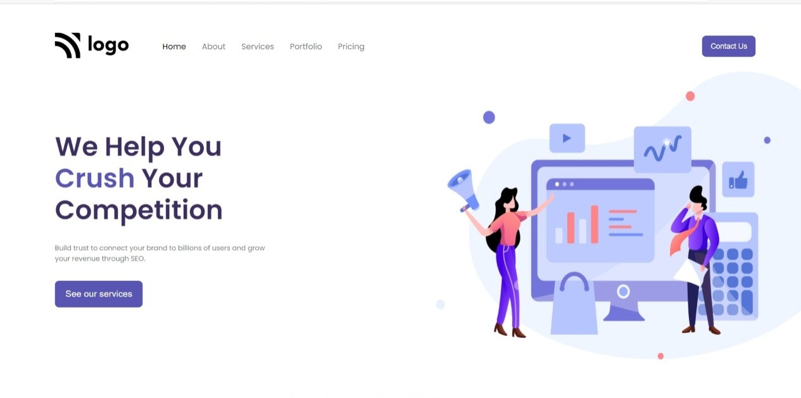

# Assignment-4 
## (Digital Marketing Homepage) 

> In this project, I have used HTML (the Hypertext Markup Language) and CSS (Cascading Style Sheets), which are two of the core technologies for building Web pages. It is a static and non-responsive page.

### As a result of this project, I learn the following:
[LIVE-LINK](https://digitalmarketinghomepage.netlify.app/)

- [x] How to design beautiful buttons and navbar
- [x] Learned about how to use svg as background image
- [x] How to align images and text Side By Side

#### The duration of the project:1.30hour